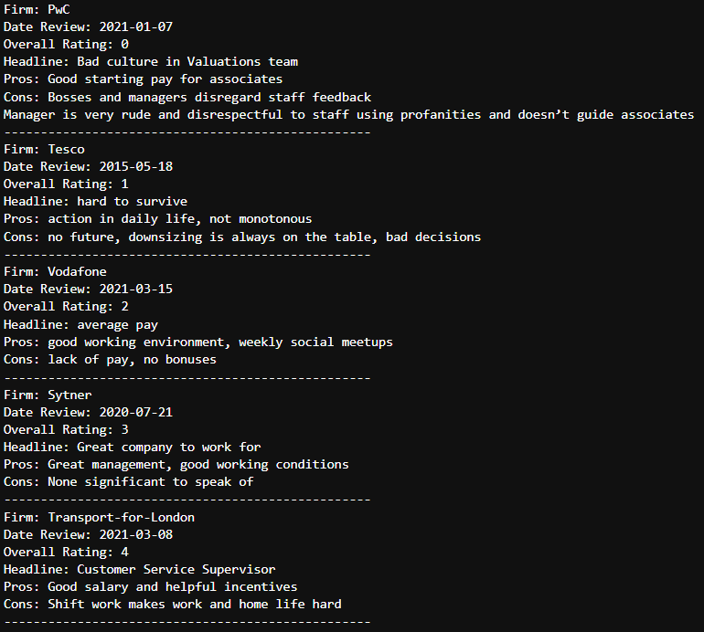
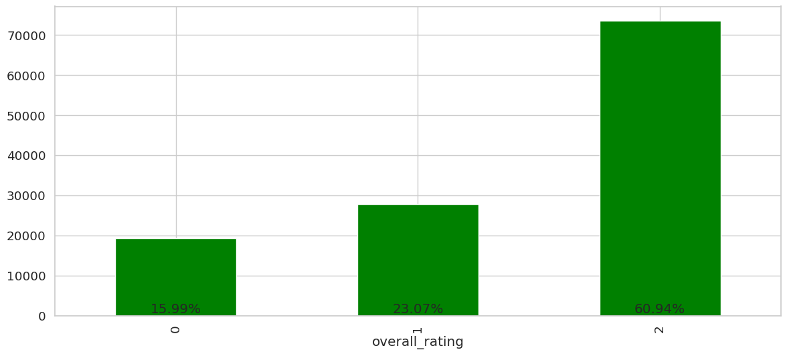
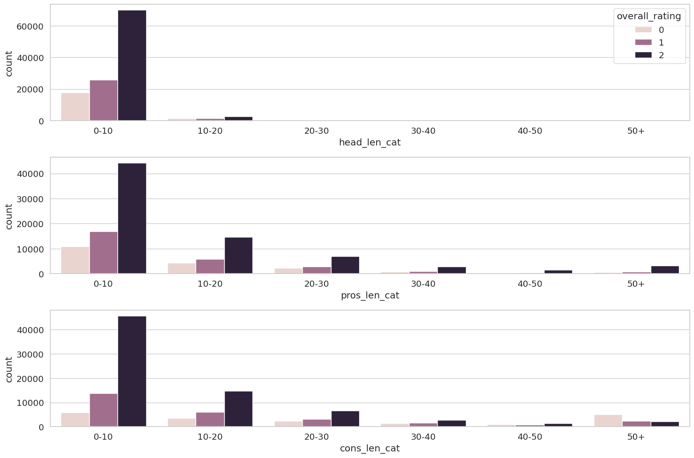
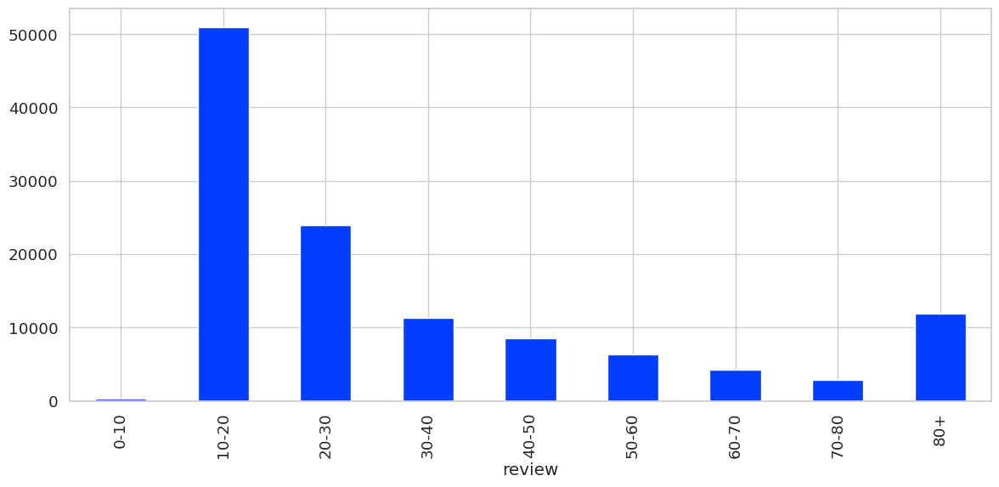
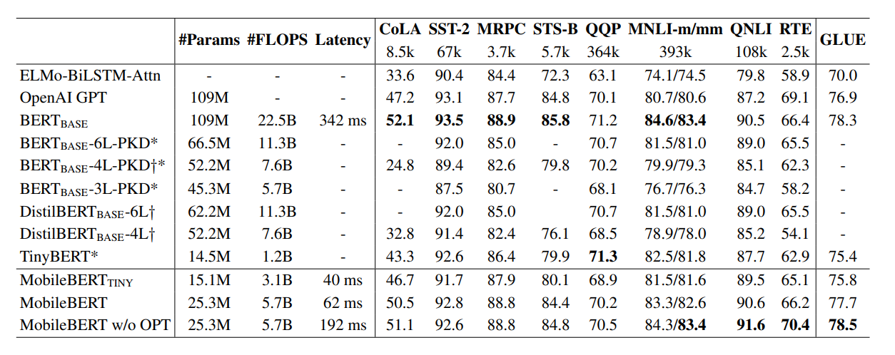
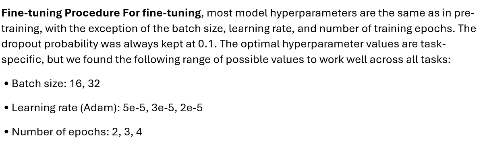
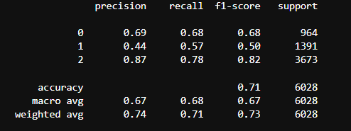
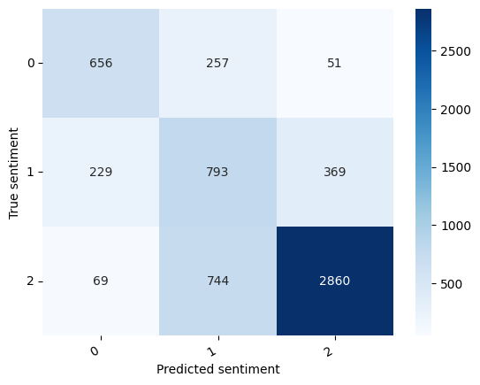

# Reports

### Preprocessing of Glassdoor Dataset

Main Dataset: [Glassdoor Dataset](https://www.kaggle.com/datasets/davidgauthier/glassdoor-job-reviews/data)

Cleaned Dataset and Checkpoints: [Google Drive](https://drive.google.com/drive/folders/1EUBl7MCEoMWBH4zklEJPmaTKCVb2W_jk?usp=sharing)

Hugging Face Model Card: [Hugging Face](https://huggingface.co/sergeantson/MobileBertSentimentClassifier)

This Jupyter notebook is tailored for conducting sentiment analysis on a dataset of employee reviews from Glassdoor, aiming to extract insights about employee satisfaction and company culture.

! Please check the requirement.txt file if you want to run the code

### Overview

The notebook is structured to guide you through the process of loading, preprocessing, analyzing, and visualizing employee sentiment data based on their reviews. It employs various data science techniques and visualization tools to provide a comprehensive analysis.

### Dataset Description

The dataset contains reviews from employees across various companies, detailing their opinions and experiences. 

For the sentiment analysis, usefull columns are overall rating, pros, cons and headline

<strong>For more information, please look at the preprocessing notebook (preprocessing.ipynb)</strong>

#### Preprocess Steps

1) Drop the duplicated data and fill the NaN values
2) Sampling the dataset (dataset have 800000 reviews!!!) for the reduce training time
3) Getting rid of the special characters in reviews (headline, pros and cons)
4) Lastly, join the all reviews in one columns (headline + pros + cons)

#### Example of Dataset

#### Percentage of Overall Rating 

 

### Headline, Pros and Cons Review Count

### Total Review Length

# Model of Sentiment Analysis (MobileBERT) and Evaluation of the Model

### Overview

This notebook provides an implementation of machine learning models with a focus on MobileBert using Python. It is designed for data processing and analysis in a Jupyter notebook environment.

### Requirements

This project is developed using Python 3 and relies on several libraries:

numpy: For numerical operations.

pandas: For data manipulation and reading.

transformers: For utilizing pre-trained models like MobileBert.

torch: For deep learning operations.

### Why MobileBert 

MobileBERT is an optimized version of BERT (Bidirectional Encoder Representations from Transformers), designed specifically for mobile devices with a focus on balancing performance with resource efficiency. Here’s why you might choose MobileBERT for sentiment analysis:

1) Efficiency: MobileBERT is engineered to operate well on devices with limited computational power and memory, such as mobile phones. It uses a smaller model size and fewer parameters compared to standard BERT models, which allows it to run faster while consuming less memory and power.

2) Performance: Despite its reduced size, MobileBERT maintains a high level of accuracy, making it suitable for complex natural language processing tasks like sentiment analysis. It is fine-tuned to preserve the performance characteristics of larger transformer models, ensuring you don't have to compromise significantly on effectiveness.

<strong>MobileBERT is a practical choice. It enables advanced NLP in environments that would otherwise be restricted by hardware capabilities.</strong>

[MobileBERT](https://arxiv.org/abs/2004.02984)

### Model Architecture

The model architecture include MobileBERT and one linear layer to classify sentiment analysis. For the decreasing overfitting, using the dropout. 

### Training the Model

Using technique in the training:

1) Gradient Clipping: Implements gradient clipping to prevent exploding gradients which often occur in deep learning models with large datasets or complex architectures.
2) Get_linear_schedule_with_warmup: A learning rate scheduler from the Hugging Face transformers library, designed for use with PyTorch. It manages the learning rate during training, especially useful for transformer models. The scheduler gradually increases the learning rate during an initial "warm-up" phase (I don't use in training), and then linearly decreases it after reaching a certain number of steps.
3) AdamW: A modification of the Adam optimizer that decouples weight decay from the gradient updates, allowing for more effective regularization and improved training outcomes. By applying weight decay after updating the parameters with gradients, AdamW prevents the decay process from interfering with the adaptive learning rate adjustments.
4) CrossEntropyLoss with weights: It allows differential importance to be assigned to classes in multi-class classification problems, which is particularly useful for handling class imbalance. This is achieved by specifying a weight tensor that scales the loss contributed by each class, emphasizing certain classes over others during training.

### Training Summary

Table of the fine tuning:

| Learning Rate | Batch Size | Best Epoch | Total Epoch | Train Accuracy | Train Loss | Val. Accuracy | Val. Loss |
|---------------|------------|------------|-------------|----------------|------------|---------------|-----------|
| **5e-5**      | **16**     | **3**      | **4**       | **0.75**       | **0.59**   | **0.71**      | **0.83**  |
| 5e-5          | 32         | 4          | 4           | 0.77           | 0.55       | 0.70          | 0.95      |
| 2e-5          | 16         | 3          | 4           | 0.77           | 0.53       | 0.69          | 1.01      |
| 2e-5          | 32         | 3          | 4           | 0.76           | 0.62       | 0.69          | 0.99      |

[BERT](https://arxiv.org/abs/1810.04805)

### Evaluation

Some statistics about our test dataset

Here's what each metric represents:

* Precision: Indicates how many of the selected items are relevant. In other words, it shows how many of the predictions made for a class actually belong to that class.

* Recall: Indicates how many of the relevant items are selected. It shows how many of the total examples belonging to a class are correctly classified by the model.

* F1-Score: It's the harmonic mean of precision and recall, providing a balanced combination of both metrics. This is particularly useful when classes are imbalanced (e.g., when one class has fewer examples than others).

* Support: Shows the number of examples in the dataset for each class.

* Accuracy: Indicates how many of the overall predictions were correct. In this case, it shows that 71% of all the model's predictions are accurate.

* Macro Avg (Macro Average): Takes the simple average of the metrics for all classes without considering class imbalance.

* Weighted Avg (Weighted Average): It's calculated by considering the support value for each class, meaning classes with more examples have a larger impact on the metric.

According to the report, the performance of classes 0 and 2 are at an acceptable level, especially class 2, which has high precision and recall values. However, class 1's performance is low; both precision and recall are low, indicating that the classification for this class is weaker compared to others. This could suggest that examples belonging to class 1 are more prone to being misclassified or that the class itself is harder to distinguish from the others.

In this confusion matrix, there are three classes, which might represent three different sentiments (as indicated by the label "Predicted sentiment" along the x-axis and "True sentiment" along the y-axis). Here's what each part of the matrix indicates:

The diagonal cells (from top left to bottom right) show the number of correct predictions that the model made. For instance, the model correctly predicted 'class 0' 656 times, 'class 1' 793 times, and 'class 2' 2860 times.

The off-diagonal cells show the number of incorrect predictions. For example, the model predicted 'class 0' when the true class was 'class 1' 229 times, and it predicted 'class 1' when the true class was 'class 2' 369 times, and so on.

### Suggestions on Improving the Model:

##### Preprocessing Part:

1) Text Normalization and Removing Stop-Word: Normalize the text by converting it to a consistent format. (e.g., replacing "can't" with "cannot") and removing the stop words which is not useful for nlp task (e.g, get rid of "and", "but", "for" ...)
2) Spelling Correction
3) Balancing the Dataset: Undersampling or Oversampling with the generative approach (SMOTE)
4) Extend the dataset

##### Model Part:

1) Hyperparameter Tuning: More parameter try or using random search
2) Cross-Validation: Use cross-validation techniques to ensure that your model generalizes well to unseen data.
3) Using Better Pre-trained Model: MobileBERT is kind of "light" model. Use model such as "ROBERTA", "ELECTRA"
4) More Complex Model Architecture: Using 3 pre-trained model for (headline, pros and cons) to encode reviews and combine them and classify  

### Sources

* Hugging Face Docs and Courses
* [YOUTUBE PLAYLIST I](https://www.youtube.com/watch?v=tFHeUSJAYbE&list=PLz-ep5RbHosU2hnz5ejezwaYpdMutMVB0&ab_channel=ShawTalebi)
* [YOUTUBE PLAYLIS II](https://www.youtube.com/watch?v=-CAC4wK9Ey0&list=PLEJK-H61XlwxpfpVzt3oDLQ8vr1XiEhev&index=1&ab_channel=VenelinValkov)
